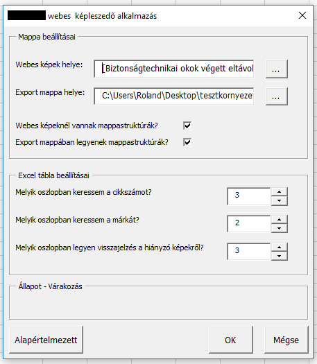
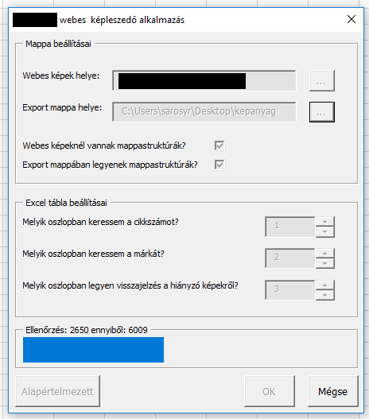

'Image database' internal excel add-in
===================================

This add-in creates a new ribbon menu with a nested dropdown menu where the user can select said menu to open a userform  

Features and how-to
--------------

- Select the location of the server to copy the files from
- Select the location where the files should be copied
- Additionally, select whether the server location has the images sorted by brand (a certain brand's images are under one folder) or not
- Additionally, select whether the copied files should be sorted by their brand
- Select the number of the columns for the product SKUs, brands and alerts if the image was not found
- Click OK to start the process  
  
  
  
  
  
- Additonally, clicking the Default button will reset the userform.
- Clicking Cancel will exit the userform.  

Getting Started
---------------

If you or your company already has an excel add-in:

- Copy the contents of the **frame** folder and add it to the existing creation subroutine
- Copy the .frx and .frm files from the **addin** folder and add it to the XLAM project

If this is the first time you'll use an excel add-in:

- Copy the contens from the **frame** folder and the .frx, .frm files from the **addin** folder and add both to a new VBA project
- Insert the .frm and .frx files into the project under *userforms*
- Save the project and exit the project editor
- Save the excel file as an Excel Macro-Enabled Add-In file (XLAM for short)
- Save and distribute the newly created file
- Every user should add this file to their excel client under settings/extensions

Note: Due to safety protocols of Microsoft Excel, if any extension is put on a server (even local) the extension will not function properly. It is advised that each user should store their own copy on their local computer

Support and inquires
--------------------

- Twitter: @rolandsarosy
- Facebook: @roland.sarosy
- Github: @rolandsarosy

Patches are encouraged, and may be submitted by forking this project and
submitting a pull request through GitHub.  
  
Because of internal decisions the code and labels are both in hungarian.

License
-------

Licensed to the Apache Software Foundation (ASF) under one or more contributor
license agreements.  See the NOTICE file distributed with this work for
additional information regarding copyright ownership.  The ASF licenses this
file to you under the Apache License, Version 2.0 (the "License"); you may not
use this file except in compliance with the License.  You may obtain a copy of
the License at

http://www.apache.org/licenses/LICENSE-2.0

Unless required by applicable law or agreed to in writing, software
distributed under the License is distributed on an "AS IS" BASIS, WITHOUT
WARRANTIES OR CONDITIONS OF ANY KIND, either express or implied.  See the
License for the specific language governing permissions and limitations under
the License.
